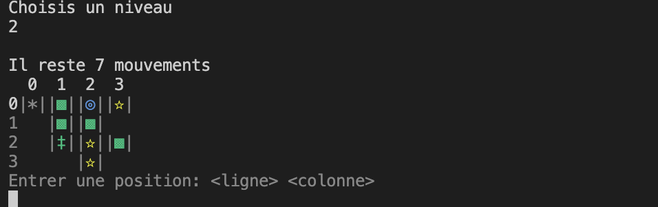

# Humbug
<!-- ❌ Don't Delete This Comment ❌
Project short description:
  Clone of the Humbug game from studio Dunderbit (https://www.dunderbit.com)
Project Topics (tags):
  java cli maven
-->

This application is a clone of the Humbug game from studio [Dunderbit](https://www.dunderbit.com).
It respects the MVC architecture and the SOLID principles.

## Features

* Use the command line to interact with the game
* Levels are stored in JSON files in `g53298.humbug/src/main/resources/level`

## Technologies

* Java
* Maven

## Documentation

### Class Diagram

## Screenshots

### Command Line Interface

